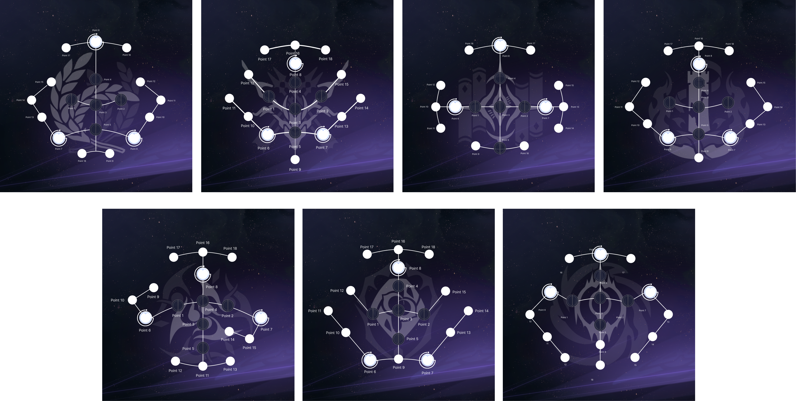

# EnkaNetwork.js

EN | [ES](./README_ES.md)

A package to get data from the Enka API, for both Genshin and Star Rail, it also includes a finder that you can use to search for names and images of game assets, for example a name or image of a character. Check [Finders](#asset-finder) for more information.

## Changelog
<details>
	<summary>Click to expand</summary>

	- v2.6.6:
	  - Added support for new CN UIDs (3XXXXXXXX).
	  - Added max level by ascension to characters in both Genshin and Star Rail.
	- v2.6.5:
	  - Fixed the issue of MoC and FH finished floors being incorrect.
	  - Added character element for Genshin Impact.
	  - Changed the way `fhLastFinishedFloor` works adding the last finished floors for jarilo vi and the xianzhou luofu. Check the breaking changes (BREAKING_CHANGES.md)
	- v2.6.3:
	  - Added Star Rail 1.6 version content.
	- v2.6.2:
	  - Forgot to include some properties in the hashes json of Genshin :)
	- v2.6.1:
	  - Added Genshin 4.3 version content.
	- v2.6.0:
	  - Added character stats calculation for Star Rail.
	  - Added Star Rail 1.5 version content.
	- v2.5.3:
	  - Added Genshin 4.2 version content.
	- v2.5.2:
	  - Fixed the icon paths of traces.
	  - Fixed a bug in player's profile pictures of Star Rail.
	- v2.5.1:
	  - Added Star Rail version 1.4 content.
	  - Updated the structure of record info to match the API.
	- v2.5.0 (contains minor breaking changes (./BREAKING_CHANGES.md#from-v221-to-250)):
	  - Added fully support for Star Rail API.
	  - Implemented the new profile picture system for Genshin.
	  - Improved the optimization.
	  - Fixed some bugs.
	- v2.2.1:
	  - Added the 4.0 version content.
	  - Fixed when a player had an element-less traveler in the profile it would throw an error.
	  - Fixed incorrect assets display for the Traveler.
	  - Fixed some bugs.
	- v2.1.9:
	  - Added trailing slash at the end of Enka profile related endpoints to prevent redirections and improve rate limit stability.
	- v2.1.8:
	  - Quick fix of the problem when someone's profile's hoyo had builds of Honkai: Star Rail it would throw an error when trying to fetch them, the support for said hoyos will come very soon.
	- v2.1.7:
	  - Added the 3.8 version content.
	- v2.1.6:
	  - Added the 3.7 version content.
	  - Added a parser to parse the substat IDs of the artifacts: `Wrapper.parseSubstats()`.
	- v2.1.4:
	  - Removed the content file reload since it would increase significantly the time to request players data.
	- v2.1.3:
	  - Fixed when trying to use the `character()` method of **AssetFinder** class would throw an error if the character id was the one of a travelers and their depot skill id.
	  - Fixed when the content updater downloads the files without all the content leading to errors.
	  - Now it won't be necessary to restart the application when the new content files are downloaded to read the new information.
	  - If a cache file it's corrupted it will automatically delete it and add a new cache file with fresh data.
	  - You can now delete the cache folder with `CacheHandler.deleteCacheDirectory()`.
	- v2.1.2:
	  - Fixed when a player had the traveler in the showcase it would throw an error.
	- v2.1.1:
	  - Fixed wrong skills order display of characters.
	  - Added a costume finder to `AssetFinder`.
	  - Added the 3.5 content.
	- v2.1.0 ([Breaking changes](/BREAKING_CHANGES.md) from &lt;v2.0.2):
	  - Implemented the new profile routes and data.
	  - Changed profile structure, refer to the [new structure](/STRUCTURE.md).
	  - Updated the player structure to add the `owner` field.
	  - Fixed when you search for a weapon name it returns an empty string.
	  - Fixed errors and bugs.
	- v2.0.2:
	  - Fixed when a character's weapon doesn't have refinement throws an error.
	- v2.0.1:
	  - Changed the player request endpoint since `/u/<UID>/__data.json` is now deprecated and will stop existing in 2 days.
	  - Removed the `key` parameter from the **Wrapper** class since it's no longer needed.
	  - Added profile API route (in case it exists) in the player structure.
	- v2.0.0:
	  - Reworked the entire data structure and some package structure.
	  - Merged `AssetNameFinder` and `AssetImageFinder` into `AssetFinder`.
	  - Added an auto updater for the new genshin versions content.
	  - Added cache system (optional) to reduce the requests sent to Enka API.
	  - Fixed some bugs and errors.
	  - Added JSDoc.
	- v1.3.10: 
	  - Reduced file amount of the package.
	- v1.3.9:
	  - Added 3.3 version content + IT and TR Languages
	- v1.3.6
	  - Added 3.2 version content.
	  - Now you can access to asset names/images directly from characters, namecards, etc objects.
	- v1.3.0:
	  - Fixed Ayaka and Mona talents.
	  - Added missing proudSkillExtraLevelMap.
	  - Added support for custom User-Agent on requests.
	  - Added 3.1 version content.
	- v1.2.1:
	  - Improved data structure for better data management.
	  - Now empty values will return empty strings, arrays and objects depending on the value type instead of null.
	  - Fixed some bugs.
	  - Added profiles API support.
	- v1.1.1:
	  - Added 3.0 version content.
	  - Added gacha images for characters.
	  - Changed the url of enka CDN.
	- v1.0.1:
	  - Changed the request url to prevent getting unnecessary 301s.
</details>

## Table of Content
- [Wrapper](#wrapper)
  - [Getting started](#getting-started)
  - [Cache system](#cache-system)
  - [User profiles](#enka-profiles)
  - [Wrapper Structure vs API Structure](#wrapper-structure-vs-api-structure)
- [Content Updater](#content-updater)
- [Finders](#asset-finder)
  - [I got the icon name, but where is the image?](#i-got-the-icon-namepath-but-where-is-the-image)
- [Trace Positions](#trace-positions)
- [Creator and Support](#creator-and-support) 
- [Credits](#credits)

## Wrapper

### Getting Started
You can get the information about a player using the `getPlayer` function. Here's an example:
```js
const { Wrapper } = require('enkanetwork.js');

// Genshin client and Star Rail client.
const { genshin, starrail } = new Wrapper(options);

/** options:
 * userAgent: string -> optional (default is enkanetwork.js/v<package_version>)
 * language: string -> optional (default is English)
 * cache: boolean -> optional (default is false)
 */

// Or starrail. Works for both.
genshin.getPlayer(738081787)
.then((player) => console.log(player))
.catch((err) => console.log(err));
```

### Cache System
You can enable the cache system so the data gets cached until the ttl expires. Helps to prevent rate limits.
```js
const { Wrapper } = require('enkanetwork.js');

// Genshin and Star Rail clients.
const { genshin, starrail } = new Wrapper({
  cache: true
});

// Or starrail. Request the player data, then the next time will return the cached data until the ttl expires. 
genshin.getPlayer(738081787)
.then((player) => console.log(player))
.catch((err) => console.log(err));
```

### Enka Profiles
You can get the information about the profiles, profile linked accounts and profile builds of Enka.
```js
const { Wrapper } = require('enkanetwork.js');

// Genshin and Star Rail clients.
const { genshin, starrail } = new Wrapper();

// The functions below work either in the Genshin client and the Star Rail client.

// Get information about someone's profile.
genshin.getEnkaProfile('Jelosus1')
.then((profile) => console.log(profile))
.catch((err) => console.log(err));

// Get information about the hoyos (game accounts) of someone. 
genshin.getEnkaHoyos('Jelosus1')
.then(async (hoyo) => {
  console.log(hoyo);

  // You can get the saved character builds of the hoyo directly or you can use the method outside of this "then" callback.
  const builds = await hoyo[0].getHoyoBuilds();
  console.log(builds);
})
.catch((err) => console.log(err));

// Alternative method to get the a hoyo's character builds. The hash of the hoyo is required for this one.
genshin.getEnkaHoyoBuilds('Jelosus1', '3A8F5o')
.then((builds) => console.log(builds))
.catch((err) => console.log(err));
```

### Wrapper Structure vs API Structure

> Needs to get reworked. Stay tunned!

You can check the structure change [here](/STRUCTURE.md)

You can find `fightPropMap` original properties in [fightPropMap Data](https://api.enka.network/#/api?id=fightprop)

## Content Updater
You can automatically download the game content (Requires restart of the process to apply the changes).
```js
const { ContentUpdater } = require('enkanetwork.js');
const updater = new ContentUpdater(options);
/** options:
 * checkInterval: number -> optional (default is 20000 ms (20 seconds))
 */

// If the content is updated successfully.
updater.on('onUpdateSuccess', () => {
  console.log('The content files were successfully updated!');
});

// If the content download failed.
updater.on('onUpdateFail', (errorMessage) => {
  console.log(errorMessage);
});

// Check for updates for either Genshin and Star Rail content.
updater.checkForUpdates();
```

## Asset Finder

The finder can **only** find names and images of the assets provided in the enka API, for example it won't find the name of a quest even if you have the hash of the name.

```js
const { AssetFinder } = require('enkanetwork.js');

// Genshin and Star Rail asset finders.
const { genshin, starrail } = new AssetFinder(options);
/** options:
 * language: string -> optional. 
 * English is the default language.
 * All in-game languages supported.
 */

// Here are 2 examples that work on both type of finders.

// Genshin and Star Rail character name and assets (icons, constellation/eidolon images, etc).
genshin.character(10000046).name; // Hu Tao
genshin.character(10000046).assets; // Hu Tao's assets

starrail.character(1208).name; // Fu Xuan
starrail.character(1208).assets; // Fu Xuan assets.

// Genshin and Star Rail values of hashes.
genshin.hash(1940919994).value; // Hu Tao
starrail.hash(1558534342).value; // Fu Xuan
```

You can get the images of characters, constellations, skills, weapons, costumes, namecards and profile pictures for Genshin. You can get the images of characters, eidolons, skills, lightcones, traces, relics and profile pictures for Star Rail.

### I got the icon name/path, but where is the image?

You can get the image with the following URL: `https://enka.network/ui/[ICON_NAME].png` for Genshin or `https://enka.network/ui/hsr/[ICON_PATH].png` for Star Rail, however you can get it directly with this code:

```js
// Genshin
const url = genshin.toLink('UI_AvatarIcon_Hutao');
console.log(url); // Output: https://enka.network/ui/UI_AvatarIcon_Hutao.png

// Star Rail
const url = starrail.toLink('SpriteOutput/AvatarRoundIcon/1208.png');
console.log(url); // Output: https://enka.network/ui/hsr/SpriteOutput/AvatarRoundIcon/1208.png
```

## Trace Positions
The position of each trace depends on the path type of the character. Here is a schema for each path, credits to [FortOfFans](https://github.com/FortOfFans) for doing it.



## Creator and Support

Creator: [Jelosus1](https://github.com/Jelosus2/)
If you need support you can contact me on discord: Jelosus1.
Join the [discord server of enka](https://discord.gg/eUv6gcsjqe). You can ping me there for support.

## Credits

- Algoinde
	- Provided the stat calculation base code for the characters in Star Rail.