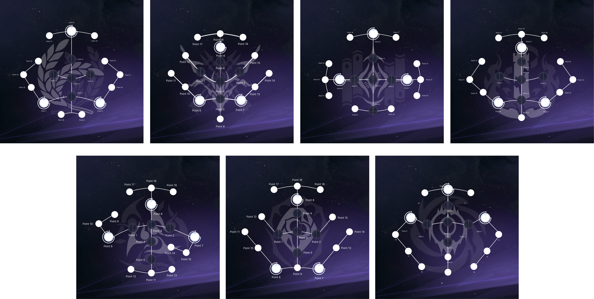

# EnkaNetwork.js


[EN](/README.md) | ES

Un paquete para obetener datos de la API de enka, para Genshin y Star Rail, también incluye un "buscador" que puedes usar para buscar nombres e imágenes de assets del juego, por ejemplo el nombre o imagen de un personaje. Revisa [Buscadores](#buscadores) para más información.

## Changelog
<details>
  <summary>Haz click para expandir</summary>

	- v2.5.0 (contiene cambios importantes menores (./BREAKING_CHANGES.md#from-v221-to-250)):
	  - Añadido full soporte para la API de Star Rail.
	  - Implementado el nuevo sistema de fotos de perfil de Genshin.
	  - Mejorada la optimización.
	  - Arreglados algunos bugs.
	- v2.2.1:
	  - Añadido el contenido de la versión 4.0.
	  - Arreglado cuando un jugador tenía en su perfil al Viajero sin elemento, tiraría un error.
	  - Arreglada la incorrecta visualización de los assets del Viajero.
	  - Algunos bugs arreglados.
	- v2.1.9:
	  - Añadida barra diagonal al final de los endpoints relacionados con los perfiles de Enka para evitar redirecciones y mejorar la estabilidad de los rate limits.
	- v2.1.8:
	  - Arreglo rápido del problema de cuando un usuario tenía builds de Honkai: Star Rail en el hoyo de su perfil tiraría un error al intentar obtenerlas, el soporte para dichos hoyos vendrá muy pronto.
	- v2.1.7:
	  - Añadido el contenido de la versión 3.8.
	- v2.1.6:
	  - Añadido el contenido de la versión 3.7.
	  - Añadido un parseador para parsear las IDs de los substats de un artefacto: `Wrapper.parseSubstats()`.
	- v2.1.4:
	  - Removido el recargar automático de los archivos porque incrementaría enormemente el tiempo de petición de información de los jugadores.
	- v2.1.3:
	  - Arreglado cuando al usar el método `character()` de la clase **AssetFinder** e introducir la id de personaje de uno de los viajeros con su id de habilidad de elemento tiraraba un error.
	  - Arreglado cuando el actualizador de contenido descargaba los archivos con el contenido incompleto, desembocando en errores.
	  - Ahora no será necesario reiniciar la aplicación cuando los archivos de contenido se descarguen para leer su nuevo contenido.
	  - Si algún archivo caché se corrompe se eliminará automáticamente y se creará uno nuevo con datos frescos.
	  - Ahora puedes borrar el directorio del caché con `CacheHandler.deleteCacheDirectory()`.
	- v2.1.2:
	  - Arreglado cuando el jugador tenía al Viajero/a en el perfil tiraba un error.
	- v2.1.1:
	  - Arreglado el error que mostraba erróneamente el orden de las habilidades de los personajes.
	  - Añadido un buscador de disfraces a `AssetFinder`.
	  - Añadido el contenido de la versión 3.5.
	- v2.1.0 ([Cambios rompedores](/BREAKING_CHANGES.md) desde <v2.0.2):
	  - Implementadas las nuevas rutas y los datos de los perfiles.
	  - Cambia la estructura de los perfiles, revisé la [nueva estructura](/STRUCTURE.md).
	  - Actualizado la estructura del jugador para añadir el campo `owner`.
	  - Arreglado cuando buscas el nombre de un arma devuelve un string vacío.
	  - Arreglados bugs y errores.
	- v2.0.2:
	  - Arreglado cuando el arma del personaje no tiene refinamiento salta un error.
	- v2.0.1:
	  - Cambiada la ruta de peticiones de información del jugador, ya que `/u/<UID>/__data.json` no se usará más y en 2 días dejará de existir.
	  - Eliminado el parametro `key` de la clase **Wrapper** ya que no se necesita más.
	  - Añadida la ruta del perfil del jugador (en caso de exista) a la estructura del jugador.
	- v2.0.0:
	  - La estructura de los datos y alguna estructura del paquete han sido rediseñadas.
	  - Se han juntado las clases `AssetNameFinder` y `AssetImageFinder` en `AssetFinder`.
	  - Añadido un auto actualizador de contenido para el contenido de las nuevas versiones de Genshin Impact.
	  - Añadido un sistema de caché (opcional) para reducir las peticiones a la API de Enka.
	  - Arreglados algunos bugs y errores.
	  - Añadido JSDoc.
	- v1.3.10: 
	  - Archivos del paquete reducidos.
	- v1.3.9:
	  - Añadido el contenido de la versión 3.3 + los idiomas IT y TR.
	- v1.3.6
	  - Añadido el contenido de la versión 3.2.
	  - Ahora puedes acceder a los nombres/imágenes de los assets directamente desde los objetos de personajes, tarjetas, etc.
	- v1.3.0:
	  - Arreglados los talentos de Ayaka y Mona.
	  - Añadido el proudSkillExtraLevelMap faltante.
	  - Añadido soporte para User Agent personalizados en las solicitudes.
	  - Añadido el contenido de la versión 3.1.
	- v1.2.1:
	  - Mejorada la estructura de los datos para un mejor manejo.
	  - Ahora los valores vacíos retornarán arreglos, objetos y strings vacíos en vez de null.
	  - Solucionados algunos bugs.
	  - Añadido soporte para la API de perfiles.
	- v1.1.1:
	  - Añadido el contenido de la versión 3.0.
	  - Añadidas las imágenes gacha de los personajes.
	  - Cambiada la url del CDN de enka.
	- v1.0.1:
	  - Cambiada la URL de peticiones para evitar códigos 301 innecesarios.
</details>

## Tabla de Contenidos
- [Wrapper](#wrapper)
	- [Empezando](#empezando)
	- [Sistema caché](#sistema-caché)
	- [Perfiles de usuario](#perfiles-de-enka)
	- [Estructura del wrapper vs Estructura de la API](#estructura-del-wrapper-vs-estructura-de-la-api)
- [Actualizador de Contenido](#actualizador-de-contenido)
- [Buscadores](#buscadores)
	- [¿He obtenido el nombre del icono, pero donde está la imagen?](#¿he-obtenido-el-nombreruta-del-icono-pero-donde-está-la-imagen)
- [Posición de Ratros](#posición-de-ratros)
- [Creador y Soporte](#creador-y-soporte) 

## Wrapper

### Empezando
Puedes obtener la información sobre un jugador usando la función `getPlayer`. Un ejemplo:
```js
const { Wrapper } = require('enkanetwork.js')

// El cliente de Genshin y Star Rail.
const { genshin, starrail } = new Wrapper(opciones);

/** opciones:
 * userAgent: string -> opcional (por defecto es enkanetwork.js/v<versión_del_paquete>)
 * language: string -> opcional (por defecto es Inglés)
 * cache: booleano -> opcional (por defecto es false) 
 */

// O starrail. Funciona para ambos
genshin.getPlayer(738081787)
.then((jugador) => console.log(jugador))
.catch((err) => console.log(err));
```

### Sistema caché
Puedes habilitar el sistema caché para que los datos estén en caché hasta que expire el ttl. Ayuda a prevenir rate limits.
```js
const { Wrapper } = require('enkanetwork.js')

// El cliente de Genshin y Star Rail.
const { genshin, starrail } = new Wrapper({
  cache: true
});

// O starrail. Pide la información del jugador y la guarda en caché hasta que el ttl expire.
genshin.getPlayer(738081787)
.then((jugador) => console.log(jugador))
.catch((err) => console.log(err));
```

### Perfiles de Enka
Puedes obtener la información de perfiles, cuentas vínculadas al perfil y builds de un perfil de Enka.
```js
const { Wrapper } = require('enkanetwork.js')

// El cliente de Genshin y Star Rail.
const { genshin, starrail } = new Wrapper();

// Las funciones de abajo funcionan tanto en el cliente de Genshin como en el de Star Rail.

// Obtener información sobre el perfil de alguien.
genshin.getEnkaProfile('Jelosus1')
.then((perfil) => console.log(perfil))
.catch((err) => console.log(err));

// Obtener información sobre los hoyos (cuentas del juego) de alguien. 
genshin.getEnkaHoyos('Jelosus1')
.then(async (hoyo) => {
  console.log(hoyo);

  // Puedes obtener directamente las builds guardadas en un hoyo o puedes usar el metodo fuera de el callback "then".
  const builds = await hoyo[0].getHoyoBuilds();
  console.log(builds);
})
.catch((err) => console.log(err));

// Metodo alternativo para obtener las builds de un hoyo. El hash del hoyo es requerido.
genshin.getEnkaHoyoBuilds('Jelosus1', '3A8F5o')
.then((builds) => console.log(builds))
.catch((err) => console.log(err));
```

### Estructura del wrapper vs Estructura de la API

> Necesita ser remodelado. Estate atento!

Puedes encontrar los cambios de la estructura [aquí](/STRUCTURE.md)

Puedes encontrar las propiedas originales de `fightPropMap` en [Datos de las fightPropMap](https://api.enka.network/#/api_es?id=fightprop)

## Actualizador de Contenido
Puedes descargar automaticamente el contenido de los juegos (Requiere reiniciar el proceso para aplicar los cambios).
```js
const { ContentUpdater } = require('enkanetwork.js')
const actualizador = new ContentUpdater(opciones);
/** opciones:
 * checkInterval: número -> opcional (por defecto son 20000 ms (20 segundos))
 */

// Si el contenido se actualiza con éxito.
actualizador.on('onUpdateSuccess', () => {
  console.log('Los archivos de contenido se han actualizado con éxito!');
});

// Si la actualización del contenido falla.
actualizador.on('onUpdateFail', (mensajeDeError) => {
  console.log(mensajeDeError);
});

// Revisa las actualizaciones, tanto de Genshin como Star Rail.
actualizador.checkForUpdates();
```

## Buscadores
El "buscador" **solo** puede encontrar los nombres y los assets que están disponibles en la API de enka, por ejemplo, no encontrarás el nombre de una misión aunque tengas el hash del nombre.

```js
const { AssetFinder } = require('enkanetwork.js')

// El buscador de assets de Genshin y Star Rail.
const { genshin, starrail } = new AssetFinder(opciones);
/** opciones:
 * language: string -> opcional. 
 * Inglés es el idioma por defecto.
 * Todos los lenguajes del juego soportados.
 */

// Aquí 2 ejemplos que funcionan en los dos tipos de buscadores.

// Assets y nombre de un personaje de Genshin y Star Rail (iconos, constelaciones/eidolones imágenes, etc).
genshin.character(10000046).name; // Hu Tao
genshin.character(10000046).assets; // Assets de Hu Tao

starrail.character(1208).name; // Fu Xuan
starrail.character(1208).assets; // Assets de Fu Xuan.

// Valor de los hashes de Genshin y Star Rail.
genshin.hash(1940919994).value; // Hu Tao
starrail.hash(1558534342).value; // Fu Xuan
```

También puedes obtener las imágenes de personajes, constelaciones, habilidades, armas, disfraces, tarjetas de presentación y fotos de perfil para Genshin. También puedes obtener las imágenes de personajes, eidolones, habilidades, conos de luz, rastros, artefactos y fotos de perfil para Star Rail.

### ¿He obtenido el nombre/ruta del icono, pero donde está la imagen?

Puedes obtener la imagen con la siguiente URL: `https://enka.network/ui/[NOMBRE_DEL_ICONO].png` para Genshin o `https://enka.network/ui/[RUTA_DEL_ICONO].png`, aunque también puedes obtenerla directamente con este código:

```js
// Genshin
const url = genshin.toLink('UI_AvatarIcon_Hutao');
console.log(url); // Resultado: https://enka.network/ui/UI_AvatarIcon_Hutao.png

// Star Rail
const url = starrail.toLink('SpriteOutput/AvatarRoundIcon/1208.png');
console.log(url); // Resultado: https://enka.network/ui/hsr/SpriteOutput/AvatarRoundIcon/1208.png
```

## Posición de Ratros
La posición de los rastros depende del tipo de vía del personaje. Aquí muestro un esquema por cada vía, creditos para [FortOfFans](https://github.com/FortOfFans) por crearlo.



## Creador y Soporte

Creador: [Jelosus1](https://github.com/Jelosus2/)
Si necesitas soporte puedes contactarme por discord: Jelosus1.
Unete al [servidor de discord de enka](https://discord.gg/eUv6gcsjqe). Puedes mencionarme allí también para obtener soporte.
